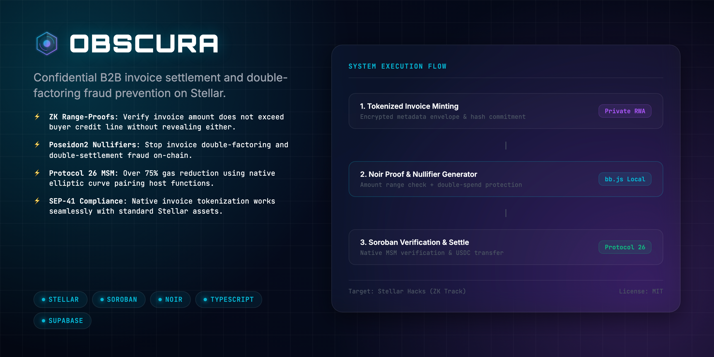
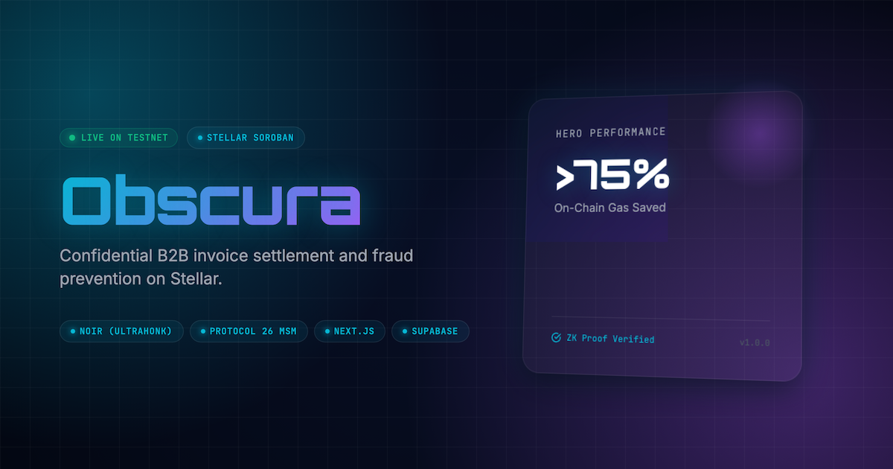
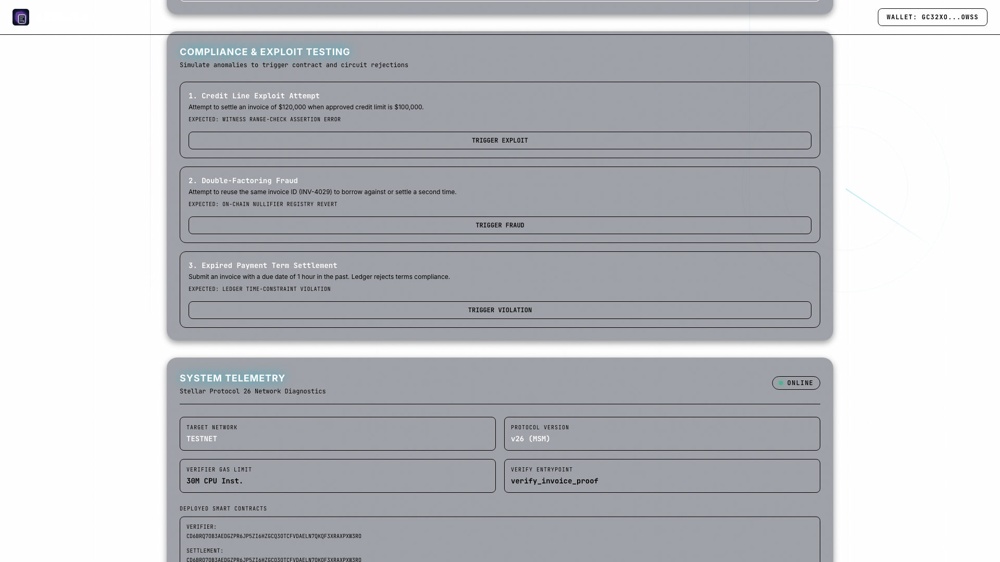
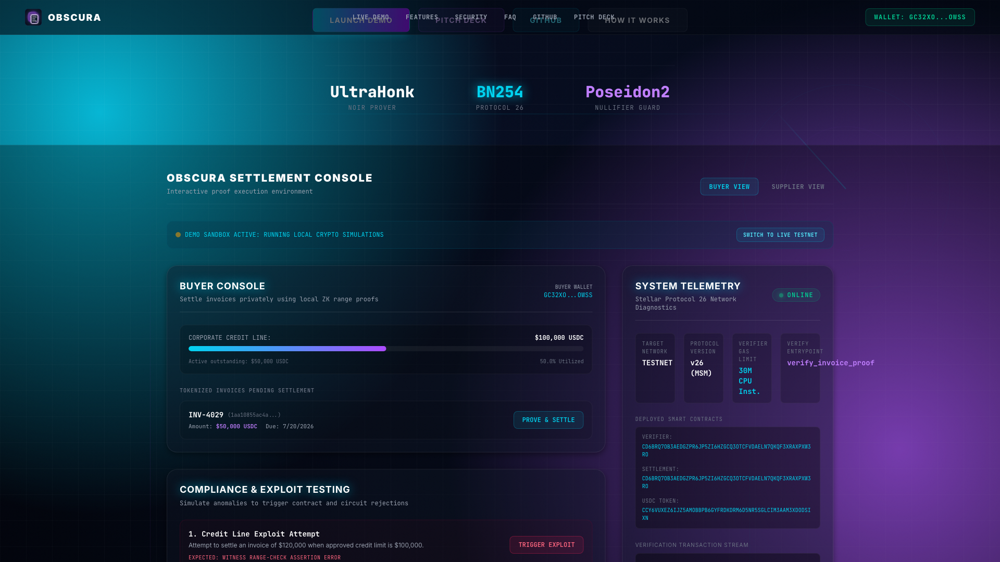
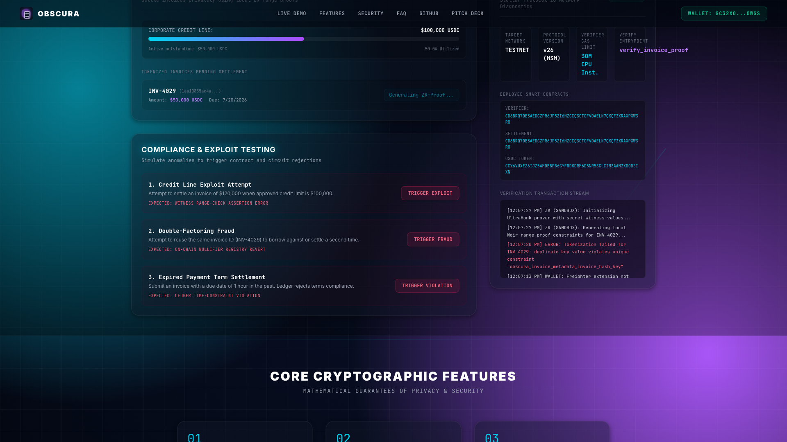
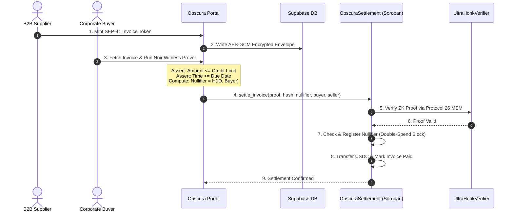
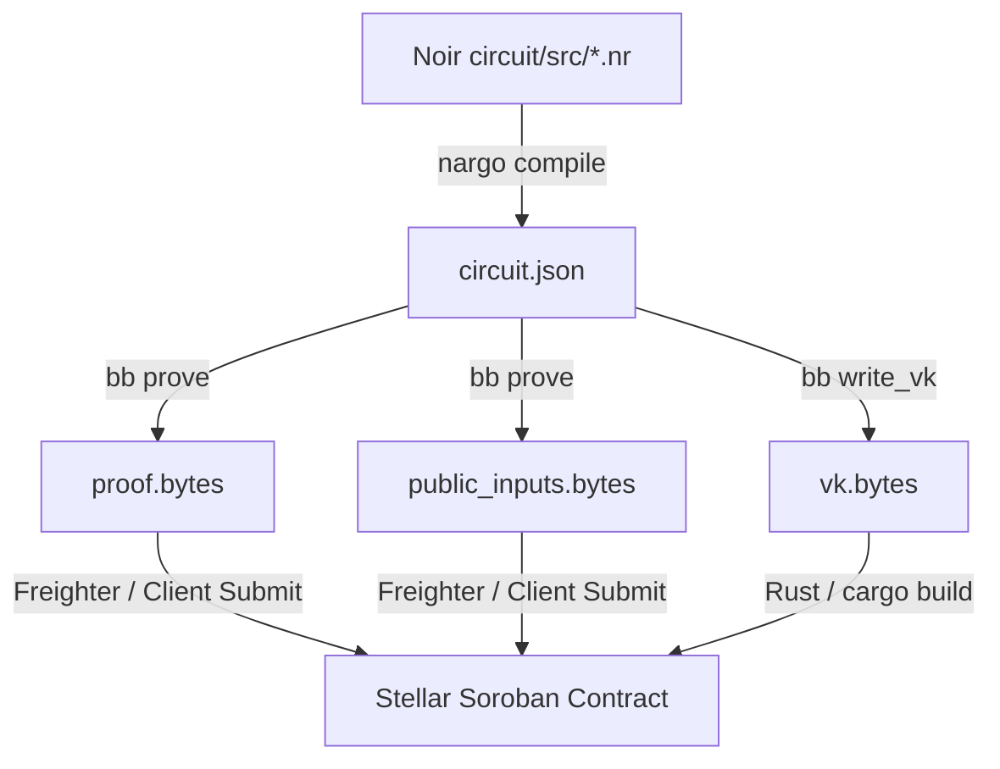

<div align="center">
  
  <h1>Obscura 🔮</h1>
  <p><em>Confidential B2B Invoice Settlement &amp; Double-Factoring Fraud Prevention on Stellar</em></p>
  

  <p><strong>✅ Real Noir/UltraHonk proof verified on Stellar testnet.</strong><br/>
  Reproduce with <code>npm run prove:demo</code> — settlement contract <code>CD6BRQ7OB3AEDGZPR6JP5ZI6HZGCQ3OTCFVDAELN7QKQF3XRAXPXW3RO</code>; a fresh Barretenberg UltraHonk proof makes <code>verify_invoice_proof</code> return true on-chain, and tampered inputs are rejected.<br/>
  <strong>Don&rsquo;t trust us — verify it in your browser:</strong> click <strong>&ldquo;Verify a real proof on-chain&rdquo;</strong> on the <a href="https://obscura.edycu.dev">live site</a> (no wallet needed) — a read-only Soroban call returns <code>true</code> for a real proof and <code>false</code> for tampered inputs.<br/>
  <em>Honest status: the interactive console uses local crypto simulations for UX; the load-bearing ZK is that deployed contract plus <code>npm run prove:demo</code> — both now witnessable from the site itself.</em></p>

  <br/>

[](https://obscura.edycu.dev)
[](https://obscura.edycu.dev/pitch.html)
[](https://youtu.be/PZ9tChsAwas)
[](https://dorahacks.io/hackathon/stellar-hacks-zk)

  <br/>


[](https://github.com/edycutjong/obscura/tree/main/contract)

[](https://opensource.org/licenses/MIT)
[](https://github.com/edycutjong/obscura/actions/workflows/ci.yml)

</div>

---

## 🧩 Part of the Stellar ZK Suite

Five ZK-gated apps, one thesis: **real on-chain zero-knowledge on Stellar Soroban** (Protocol 25/26, native BN254 host functions). Each verifies a _fresh_ proof against a deployed testnet contract, reproducible with `npm run prove:demo` (valid proof ⇒ `true`, tampered ⇒ `false`). Built solo for **Stellar Hacks: Real-World ZK**.

| App                                                                   | Proves privately                                                          | ZK stack                 | Links                                                                     |
| --------------------------------------------------------------------- | ------------------------------------------------------------------------- | ------------------------ | ------------------------------------------------------------------------- |
| 👤 **[Shroud](https://github.com/edycutjong/shroud)** ⭐ **flagship** | Compliant privacy pool — withdraw only if in the ASP compliance set       | Circom · Groth16 (BN254) | [site](https://shroud.edycu.dev) · [video](https://youtu.be/WhIzP_K0UBU)  |
| 🔬 **[Crisp](https://github.com/edycutjong/crisp)**                   | Proof-of-reserves — reserves ≥ liabilities, balances hidden               | Circom · Groth16 (BN254) | [site](https://crisp.edycu.dev) · [video](https://youtu.be/fhVVoZKz7sI)   |
| 🤫 **[Sotto](https://github.com/edycutjong/sotto)**                   | Sealed-bid auctions — winner is the lowest valid bid, losers hidden       | Circom · Groth16 (BN254) | [site](https://sotto.edycu.dev) · [video](https://youtu.be/PAbWjCXx5XU)   |
| 🔮 **[Obscura](https://github.com/edycutjong/obscura)**               | B2B invoice settlement — within credit terms, no double-factoring         | Noir · UltraHonk         | [site](https://obscura.edycu.dev) · [video](https://youtu.be/PZ9tChsAwas) |
| 🦓 **[Zebra](https://github.com/edycutjong/zebra)**                   | Confidential payroll — KYC'd recipients + correct totals, salaries hidden | Noir · UltraHonk         | [site](https://zebra.edycu.dev) · [video](https://youtu.be/KatlfYRjvw8)   |

🚩 **Flagship: [Shroud](https://github.com/edycutjong/shroud)** — the compliant privacy pool (ASP gateway, per the SDF's recommended design). All five share the same circuits-to-Soroban verification harness.

---

## 💡 The Problem & Solution

### The Problem

Traditional B2B supply chains moving to public blockchains face major data liabilities. Competitors can monitor settlement contracts, identify invoice values passing between addresses, and reverse-engineer sensitive wholesale pricing structures (**Pricing Leakage**). Additionally, suppliers can borrow against or settle the same invoice with multiple trade financiers (**Double-Factoring Fraud**), costing billions annually.

### The Solution

**Obscura** solves this supply-chain privacy-vs-compliance paradox. Invoices are tokenized as SEP-41 compliant assets with client-side encrypted metadata. Buyers settle invoices privately in USDC by compiling a client-side Noir ZK proof. This proof verifies the invoice amount is within approved corporate credit limits and paid on time, without exposing the amount on-ledger. Double-factoring is blocked by registering Poseidon2 nullifier hashes on-chain.

---

## 📸 See it in Action

<div align="center">
  
</div>

<div align="center">
  
  
  
  <br/>
  <sub><em>Invoice tokenization &amp; confidential settlement (demo sandbox). Reproduce the real proof with <code>npm run prove:demo</code>.</em></sub>
</div>

The confidential settlement flow represents **one core pipeline executed with extreme depth**:



### ZK Compilation & Proving Toolchain Flow (Noir)



---

---

## ✅ Proof of On-Chain Verification (reproduce it)

`npm run prove:demo` compiles the Noir circuit, generates a **fresh** UltraHonk proof, and verifies it live on Stellar testnet — valid proof ⇒ `true`, tampered inputs ⇒ `false`. Example run:

```text
Compiling Noir circuit + solving witness...
Generating real UltraHonk proof (Barretenberg, keccak oracle)...
Proof verified successfully
Submitting on-chain verify_invoice_proof to CD6BRQ7OB3AEDGZPR6JP5ZI6HZGCQ3OTCFVDAELN7QKQF3XRAXPXW3RO ...
on-chain verify_invoice_proof => true
on-chain verify_invoice_proof (tampered) => false

✅ Real Noir/UltraHonk invoice proof verified on-chain; tampered proof rejected.
```

- **Settlement contract (testnet):** [`CD6BRQ7O…XW3RO`](https://stellar.expert/explorer/testnet/contract/CD6BRQ7OB3AEDGZPR6JP5ZI6HZGCQ3OTCFVDAELN7QKQF3XRAXPXW3RO)

---

## 🏗️ Architecture & Tech Stack

| Layer                 | Technology                           | Description                                                 |
| --------------------- | ------------------------------------ | ----------------------------------------------------------- |
| **ZK Circuits**       | Noir (v0.35.0)                       | High-level ZK language compiling to Barretenberg UltraHonk  |
| **Verifier Contract** | Rust / Soroban SDK                   | Validates range proofs on Stellar Testnet                   |
| **Frontend**          | Next.js 16 (App Router), Tailwind v4 | Developer sandbox and procurement console                   |
| **Database**          | Supabase (PostgreSQL)                | Stores encrypted invoice metadata and RLS configurations    |
| **SDK**               | `@stellar/stellar-sdk`               | Interfaces with Horizon RPC and handles ledger transactions |

---

## 🏆 Sponsor Tracks Targeted

### Stellar Hacks: Real-World ZK

1.  **Protocol 26 BN254 host functions (via embedded `rs-soroban-ultrahonk`)**: The contract embeds the UltraHonk verifier, which uses Stellar's native BN254 multi-scalar-multiplication / scalar-field host functions to verify the range proof on-chain inside the CPU budget (a pure-WASM verifier would not fit). Exercised transitively, not via a direct `env.crypto()` call.
2.  **SEP-41 Token Standard Integration**: Standardizes invoice assets to integrate seamlessly with the Stellar DeFi ecosystem.
3.  **Soroban Native Auth Framework (`Address::require_auth()`)**: Enforces secure, non-interactive buyer approvals for stablecoin transfers.
4.  **Time-Lock Constraints (`env.ledger().timestamp()`)**: Evaluates terms compliance against ledger timestamps.
5.  **Native Event Logs (`env.events().publish()`)**: Dispatches atomic settlement receipt status feeds.

### Honest Technical Limitation

Our prototype evaluates credit limits per invoice (`invoice_amount <= credit_line`). It does not track cumulative outstanding unpaid debt across parallel transactions. Production implementation requires maintaining a global credit balance state in the smart contract.

---

## 🚀 Getting Started

### Prerequisites

- Node.js &ge; 20
- npm
- Rust &amp; Cargo (to test contracts)

### Installation

1.  Clone this repository.
2.  Install packages:
    ```bash
    npm install
    ```
3.  Configure `.env.local` based on `.env.example`.
4.  Launch local development server:
    ```bash
    npm run dev
    ```

## ⛓️ Smart Contract Specifications

### Compiler Requirements

Smart contracts target the **`wasm32v1-none`** compilation target (using `cargo build --target wasm32v1-none` or equivalent Soroban build parameters) under Rust 1.82+ to ensure compatibility with Stellar's Protocol 25/26 BN254 EC pairing host functions.

### Deployed Contract Details

- **Settlement & Escrow Contract:** `CD6BRQ7OB3AEDGZPR6JP5ZI6HZGCQ3OTCFVDAELN7QKQF3XRAXPXW3RO`
- **UltraHonk Verifier Contract:** Deployed dynamically during setup.

### Contract Endpoints & Parameters

#### 1. ObscuraSettlement

Orchestrates private invoice settlement and prevents double-factoring:

- `initialize(env: Env, admin: Address, verifier: Address, usdc_token: Address)`: Set the admin, UltraHonk verifier, and USDC token addresses.
- `set_verification_key(env: Env, admin: Address, vk_bytes: Bytes)`: Set the ZK verification key (admin auth required).
- `settle_invoice(env: Env, proof: Bytes, public_inputs: Bytes, buyer: Address, seller: Address, amount: i128) -> bool`: Settle a B2B invoice privately in USDC by verifying the ZK range proof against the public inputs. Public inputs are expected in Barretenberg layout (160 bytes total): `[due_date (32B), buyer_address (32B), seller_address (32B), invoice_hash (32B), nullifier (32B)]`. Restricts double-settlement via the nullifier and triggers the USDC transfer (buyer auth required).
- `is_settled(env: Env, nullifier: BytesN<32>) -> bool`: Read-only checker to see if a nullifier has already been spent.
- `verify_invoice_proof(env: Env, proof: Bytes, public_inputs: Bytes) -> bool`: Read-only proof verifier helper.

#### 2. UltraHonkVerifier

Underlying verifier contract using Protocol 26 host functions:

- `verify_proof(env: Env, vk_bytes: Bytes, proof_bytes: Bytes, public_inputs: Bytes) -> bool`: Verifies a Noir/UltraHonk proof against the provided verification key and public inputs.

### 🔭 v3 extensions — deployed as dedicated contracts, not wired into the demo web app

> **Honest status:** the v1 settlement contract verifies the invoice range/nullifier UltraHonk proof (`settle_invoice`). The v3 bilateral netting (`circuit_netting`) and multilateral netting (`circuit_multinet`) ship as **separate, dedicated contracts** with their own VKs, verified on Stellar testnet and reproducible from the CLI (see Roadmap below). They are **not wired into the hosted demo web app**, which demos the v1 flow only.

- `settle_netting_v3(...)` **[v3, shipped]** — Bilateral invoice netting: a single atomic transfer settling N invoices between two counterparties via a ZK proof that the net amount is correct (`net_amount + total_payables == total_receivables`), with session-nullifier + batch-commitment replay protection, against a dedicated netting VK on testnet contract `CBNM47QOFFPWY4HVIIVF5TSLQ65J7TZB54JX7FR7KKYEQMYYUOJHSOA2`. Reproduce: `npm run prove:demo:netting`.

## 🧪 Testing & CI

Our codebase is backed by a **6-stage GitHub Actions CI pipeline** validating quality, security, bundle sizes, and performance.

```bash
# Run 120+ unit and integration assertions (ZK constraints, AES schemas, API keys)
npm test

# Run Soroban smart contract Rust unit tests
cd contract
cargo test
```

| Suite                      | Scope                                         | Status  |
| -------------------------- | --------------------------------------------- | ------- |
| **Noir Circuits**          | Range limits, due dates, Poseidon2 nullifier  | ✅ Pass |
| **Soroban Smart Contract** | Unique nullifiers, auth rules, USDC transfers | ✅ Pass |
| **ECIES Tokenizer**        | Client-side AES-GCM metadata encryption       | ✅ Pass |
| **Telemetry APIs**         | Integration verifier JSON checks              | ✅ Pass |

---

## 📁 Project Structure

```
dorahacks-stellarzh-obscura/
├── .github/             # GitHub Actions CI/CD workflows
├── circuit/             # Noir ZK single invoice circuit
├── circuit_multinet/    # Noir ZK multilateral netting circuit
├── circuit_netting/     # Noir ZK bilateral netting circuit
├── contract/            # Soroban smart contract source code
├── db/                  # Database migration schemas & seeds
├── docs/                # Design assets & developer friction logs
├── e2e/                 # Playwright E2E browser test suites
├── scripts/             # Unit tests, readiness checks, benchmarks
├── src/
│   ├── app/             # Next.js pages & API routes
│   └── lib/             # Shared client libs & encryption/decryption keys
├── Makefile             # Harness automation commands
└── README.md            # You are here
```

---

## 📊 Performance & Gas Benchmarks

Obscura verifies invoice range proofs on Stellar using native BN254 pairings via Protocol 26 host functions. Below are the resource costs measured on-chain during unit tests:

| Operation                    | CPU Instructions | Memory (Bytes) | % of Limit |
| ---------------------------- | ---------------- | -------------- | ---------- |
| ZK Verification & Settlement | 144,562          | 51,550         | ~0.14%     |

_Benchmarks ran locally using the Soroban Rust SDK test environment (Protocol 26)._

---

## 🗺️ Roadmap

- [x] Phase 1: Core Noir range-proof circuit implementation (UltraHonk)
- [x] Phase 2: Soroban settlement contract with Poseidon2 nullifier and UltraHonk verifier
- [x] Phase 3: Client-side ECIES encryption and invoice tokenization
- [x] Phase 4: Freighter wallet integration and Next.js settlement portal
- [x] Phase 5: 6-stage engineering harness (Quality → Security → Build → E2E → Perf → Deploy)
- [x] Phase 6: Bilateral invoice netting with ZK net-amount proof (v3) — **shipped & verified on-chain.** Real `netting_circuit` Noir circuit (balance conservation across N invoices + Poseidon2 session nullifier + batch commitment) → UltraHonk proof → on-chain `verify_netting_proof` / `settle_netting_v3` against a dedicated netting VK on testnet contract `CBNM47QOFFPWY4HVIIVF5TSLQ65J7TZB54JX7FR7KKYEQMYYUOJHSOA2`. Reproduce: `npm run prove:demo:netting` (real proof → `true`, tampered inputs → `false`). Covered by contract unit tests `test_settle_netting_v3_*`.
- [x] Phase 7a: Multilateral netting graph — **shipped & verified on-chain.** Real `multinet_circuit` Noir circuit (N=4 party obligation graph → per-party netted positions, zero-diagonal, clean-net split, system conservation `sum net_pos == sum net_neg`, Poseidon session nullifier; gross obligations stay private) → UltraHonk proof → on-chain `verify_netting_proof` against a dedicated multilateral VK on testnet contract `CCAFMYQOOKT4VRRBJK2DVZBY3VHX5IAD2A3UYJCEE2WVYRYIRO4MIJED`. Reproduce: `npm run prove:demo:multinet` (real proof → `true`, tampered inputs → `false`). Verified offline (`bb verify`) + on-chain.
- [ ] Phase 7b: Supply-chain-finance integration — _designed, not deployed (requires external SCF / financing rails)_

## 📽️ Demo Materials

- **GitHub Repository**: [https://github.com/edycutjong/obscura](https://github.com/edycutjong/obscura)
- **Live App URL**: [https://obscura.edycu.dev](https://obscura.edycu.dev)
- **Pitch Deck**: [https://obscura.edycu.dev/pitch.html](https://obscura.edycu.dev/pitch.html)

---

## 📄 License

MIT © 2026 Edy Cu
